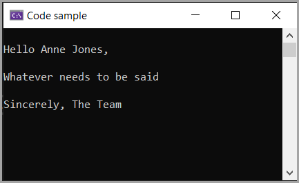

# Various ways to represent a SQL statement in C# and more

A developer writes and SQL statement in SSMS

```sql
DECLARE @CalendarYear INT = 2024;
DECLARE @CalendarMonth AS INT = 1;
DECLARE @BusinessDay AS INT = 0;
DECLARE @DayOfWeekName AS NVARCHAR(MAX) = N'Monday';

SELECT CalendarDate,
       CalendarDay,
       FirstDateOfWeek,
       LastDateOfWeek,
       CASE
           WHEN Holiday = 1 THEN
               'Yes'
           ELSE
               'No'
       END AS Holiday
FROM dbo.Calendar
WHERE CalendarYear = @CalendarYear
      AND CalendarMonth = @CalendarMonth
      AND BusinessDay = @BusinessDay
      AND DayOfWeekName = @DayOfWeekName;
```

Conventionally, the developer writes the SQL statement in a string variable in C# by flattening the SQL statement into a single line in C#.

This make it difficult to read and maintain the SQL statement.

```csharp
string statement = "SELECT CalendarDate, CalendarDay, FirstDateOfWeek, LastDateOfWeek, CASE WHEN Holiday = 1 THEN 'Yes' ELSE 'No' END AS Holiday FROM dbo.Calendar WHERE CalendarYear = @CalendarYear AND CalendarMonth = @CalendarMonth AND BusinessDay = @BusinessDay AND DayOfWeekName = @DayOfWeekName;";
```

Next level, string cancaration is used to break the SQL statement into multiple lines. This makes it easier to read and maintain the SQL statement. The SQL statement is broken into multiple lines by concatenating the lines with a `+` operator, easy to read but not maintain.

```csharp
string statement = 
    "SELECT CalendarDate, CalendarDay, FirstDateOfWeek, LastDateOfWeek, " +
    "CASE WHEN Holiday = 1 THEN 'Yes' ELSE 'No' END AS Holiday " +
    "FROM dbo.Calendar " +
    "WHERE CalendarYear = @CalendarYear AND " +
    "CalendarMonth = @CalendarMonth AND " +
    "BusinessDay = @BusinessDay AND DayOfWeekName = @DayOfWeekName;";
```

The best way to represent a SQL statement in C# is to use the verbatim string literal. The [verbatim string literal](https://learn.microsoft.com/en-us/dotnet/csharp/language-reference/tokens/verbatim) is a string that starts with `@` symbol. The verbatim string literal allows the developer to write the SQL statement as is in SSMS. The SQL statement is written in multiple lines and the verbatim string literal preserves the line breaks and white spaces.

```csharp
        string statement = @"
SELECT CalendarDate,
       CalendarDay,
       FirstDateOfWeek,
       LastDateOfWeek,
       CASE
           WHEN Holiday = 1 THEN
               'Yes'
           ELSE
               'No'
       END AS Holiday
FROM dbo.Calendar
WHERE CalendarYear = @CalendarYear
      AND CalendarMonth = @CalendarMonth
      AND BusinessDay = @BusinessDay
      AND DayOfWeekName = @DayOfWeekName;
        ";
```

## Raw string literals

With the release of .NET Core 7 [raw string literals](https://learn.microsoft.com/en-us/dotnet/csharp/language-reference/tokens/raw-string) were introduced. 

```csharp
string statement3 = 
    """
    SELECT CalendarDate,
           CalendarDay,
           FirstDateOfWeek,
           LastDateOfWeek,
           CASE
               WHEN Holiday = 1 THEN
                   'Yes'
               ELSE
                   'No'
           END AS Holiday
    FROM dbo.Calendar
    WHERE CalendarYear = @CalendarYear
          AND CalendarMonth = @CalendarMonth
          AND BusinessDay = @BusinessDay
          AND DayOfWeekName = @DayOfWeekName;
    """;
```

:bulb: To try out the raw string literals, create a console project named DemoApp targetting .NET 7.0 and replace Program.cs with the following code.

```csharp
namespace DemoApp;

internal partial class Program
{
    static void Main(string[] args)
    {

        var email = SendEmail(new Taxpayer() { FirstName = "Anne", LastName = "Jones" });
        Console.WriteLine(email);

        Console.ReadLine();
    }

    public static string SendEmail(Taxpayer taxpayer) =>
        $"""
         Hello {taxpayer.FirstName} {taxpayer.LastName},

         {Templates.Body}
         
         {Templates.Signature}
         """;
}
internal class Taxpayer
{
    public string FirstName { get; set; }
    public string LastName { get; set; }
}

internal class Templates
{
    public static string Body => "Whatever needs to be said";
    public static string Signature => "Sincerely, The Team";
}
```


Press <kbd>F5</kbd> to run and the following output will be displayed.


