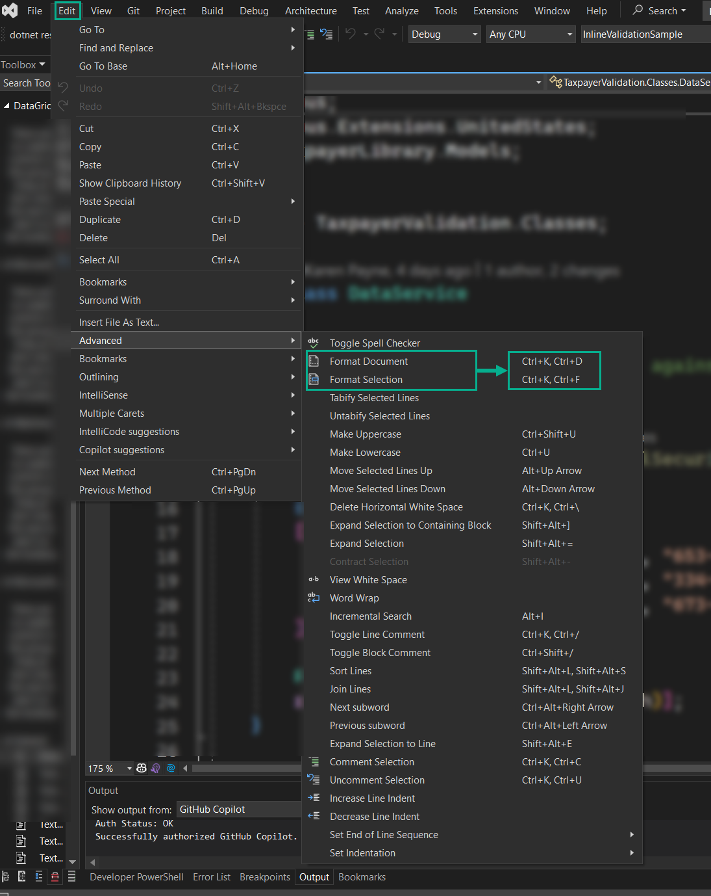
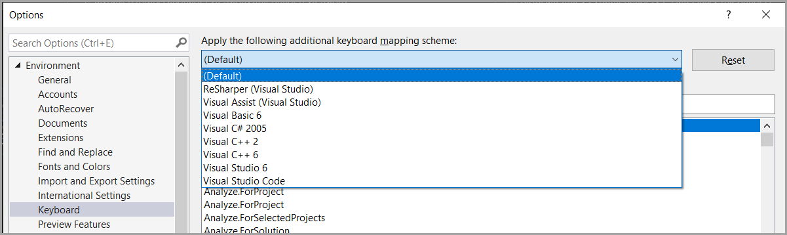
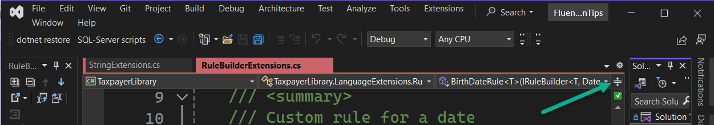
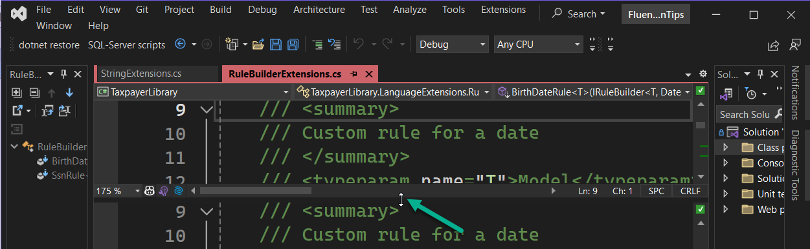
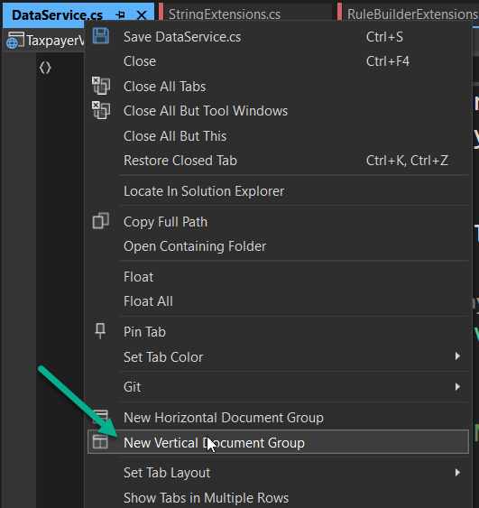
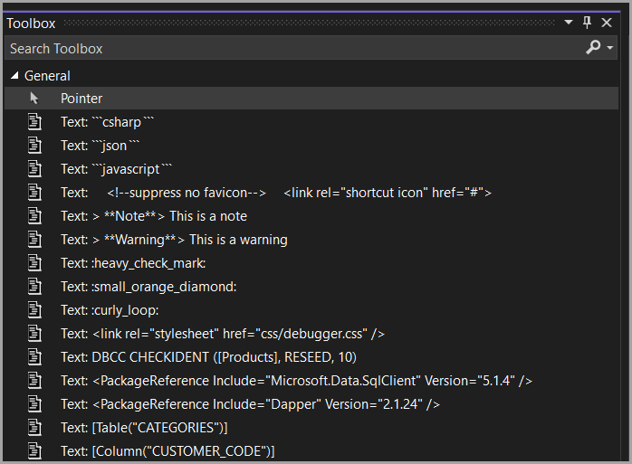

## Keyboard Shortcuts

There are many keyboard shortcuts available in Visual Studio. Here are some of the most useful ones and may differ depending on the keyboard schema selected as shown in figure 1 below.

| Description        |   Shortcut    |  Notes   |
|:------------- |:-------------|:-------------|
| Search    | <kbd>ctrl</kbd> + <kbd>T</kbd> | Provides search for files, types and members |
| Quick replace    | <kbd>ctrl</kbd> + <kbd>H</kbd> | Provides search and replace functionality in current file |
| | | See also [Search in Visual Studio 2022](https://youtu.be/NntM_ahUE54?si=GSyrNn0dcCZZLzji)
| Comment    | <kbd>ctrl</kbd> + <kbd>K</kbd>, <kbd>C</kbd> | Comments the selected code |
| Uncomment    | <kbd>ctrl</kbd> + <kbd>K</kbd>, <kbd>U</kbd> | Uncomments the selected code |
| Duplicate line    | <kbd>ctrl</kbd> + <kbd>D</kbd> | Duplicates the current line |
| Surround with    | <kbd>ctrl</kbd> + <kbd>K</kbd>, <kbd>S</kbd> | Surrounds the selected code with a snippet e.g. for, try/catch |
| Show Clipboard History    | <kbd>ctrl</kbd> + <kbd>Shift</kbd> + <kbd>V</kbd> | Shows the clipboard history |
| Solution Explorer    | <kbd>ctrl</kbd> + <kbd>Alt</kbd> + <kbd>L</kbd> | Opens the solution explorer |

### Keyboard shortcuts by menu

Sometimes the best method to learn keyboard shortcuts is by menu. The common shortcuts are shown in the menu. For example, the following shows the `Edit` menu.

> **Note**
> Some shortcuts are in submenus. For example, the `Edit` menu has a submenu called `Advanced`. The `Advanced` submenu has the `Format Document` and `Format Selection` shortcuts.
>
:bulb: [Editor shortcuts in Visual Studio]([https://](https://youtu.be/Bh1pI1llV4Q?si=oL38Ydnshnh1tp0H))

:bulb: [15 Tips to Boost Your Productivity in Visual Studio](https://youtu.be/o4kkRqzHDvw?si=IPej1cb1N5RgN91f)

### Figure 1: Keyboard schema in Visual Studio

For developer new to Visual Studio best to use the default keyboard schema. 

To change the keyboard schema, go to `Tools` -> `Options` -> `Environment` -> `Keyboard` and select the desired schema from the dropdown list.

## Windows

### Arranging windows

:bulb: [Watch the video]([Customize tool windows and documents](https://youtu.be/JERYTJwq7u8?si=vPMTuaOaCSm9cEn8))

### Splitting windows

Visual Studio allows you to edit multiple files at the same time. But you can only see one file at a time. The following shows how to view multiple files at the same time by splitting the window horizontally or vertically.

### Edit a file via splitting horizontally

Click on the following and drag down to split the window horizontally.

To go back to a single window, click on the following and drag up.

### Edit a file via splitting vertically

Right click on a tab and select `New Vertical Tab Group`.

To go back to a single window, drag the tab back to the original window on at a time.

### See the following video for a demonstration

:bulb: [Watch the video](https://youtu.be/JERYTJwq7u8?si=jxky5--vEZGvywpI)

### Saving windows layout

:bulb: [Watch the video](https://youtu.be/HTwqjthUppc?si=uTU4D8dj3SyVYIok)

## Document management in Visual Studio 2022

:bulb: [Watch the video](https://youtu.be/uhmD11WPOf8?si=k5Bp7kN1lmhpvdk6)

## The toolbox

Generally, the toolbox is used to drag and drop controls onto a form. But it can also be used to store code snippets as shown below.

Example, you have a line of code that you use frequently. You can drag and drop the code into the toolbox. To use the code snippet, drag and drop the code snippet from the toolbox to the code editor.

> **Note**
> Karen's is shown below with snippets for markdown files, project files and database code.

---

### Other

- [Case preserving find and replace in Visual Studio](https://youtu.be/iaoitDrBkBw?si=revVhY9Wo95Jsjgr)
- [Cool features in Visual Studio 2022](https://www.youtube.com/watch?v=NBfNnyPQTKs)
