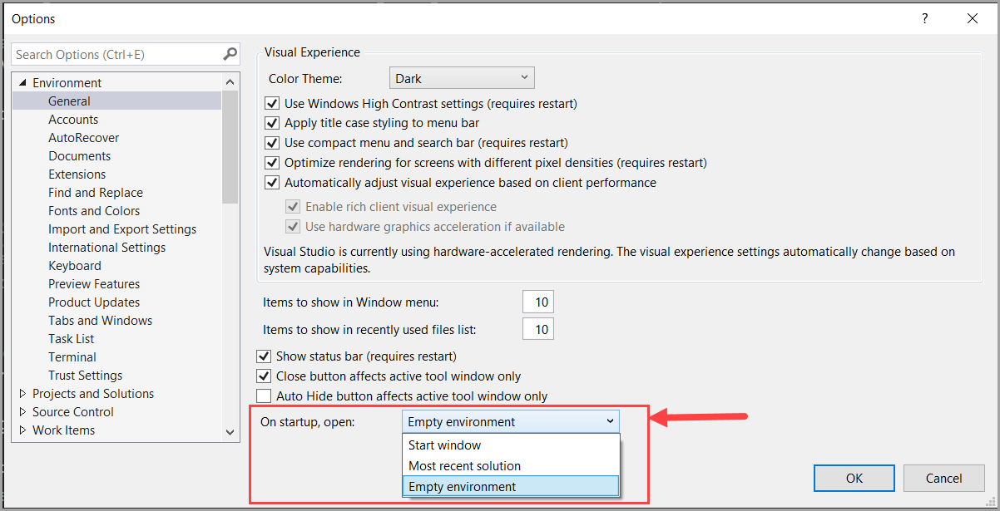
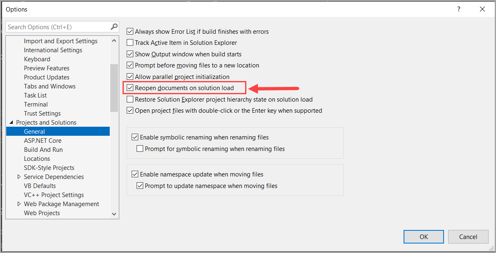
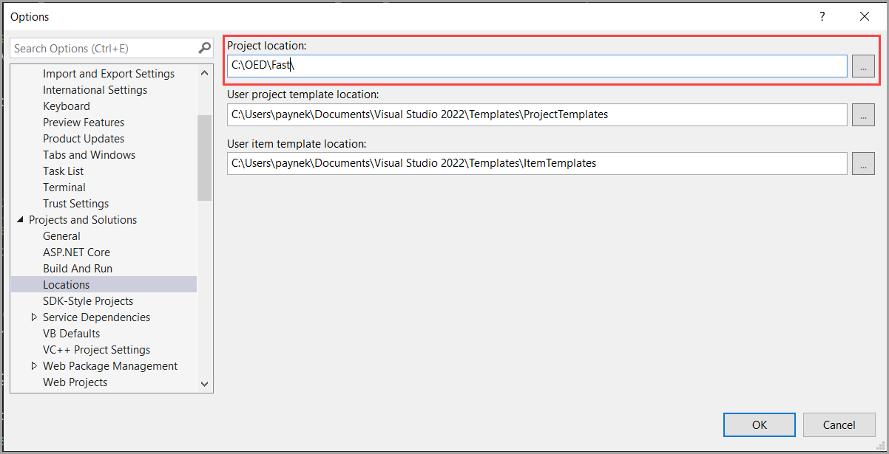

## Visual Studio settings

These are some of the settings that you can change in Visual Studio.

To change the settings, go to `Tools` -> `Options`.

## Options to start Visual Studio

- Present a dialog to select which project to open
- Open the last code session
- Open to no dialogs or last code session

Then selecting the second bullet, check Reopen documents on solution load to have the files last open to be open again.

## Default project locations

Consider placing code for Fast under `C:\OED\Fast` as the default is under your documents folder which most developers may have permission issues.

